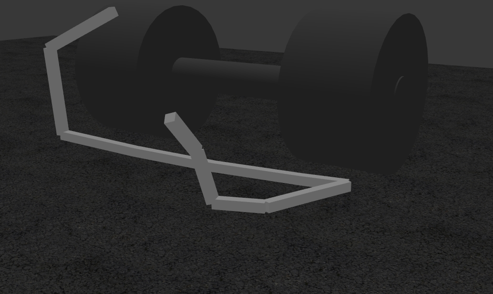

# Gazebo Simple Snake Robot
This a ros simulation of an 9 dof , 10 link snake robot.
### Usage
Install the directories to your catkin_ws folder, build the package. Robot can be spawned by typing "roslaunch snake_robot spawn.launch". After then proper commands can be passed to position controllers as topics. From terminal "rostopic pub /snake_robot/joint1_control/command std_msgs/Float64 "data: 0.0" " for which this data is angles in radians. For a simple demonstration the node "move" can also be run by "rosrun snake_robot move". Type rosrun "rqt_reconfigure rqt_reconfigure" to access to gui. If use_gui paramater is turned off, robot will move with one of the linear motion gaits that is implemented in move.cpp.

